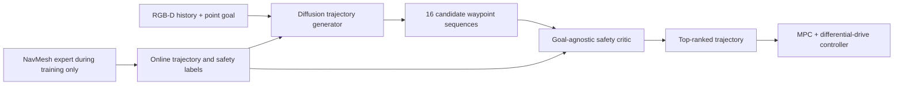
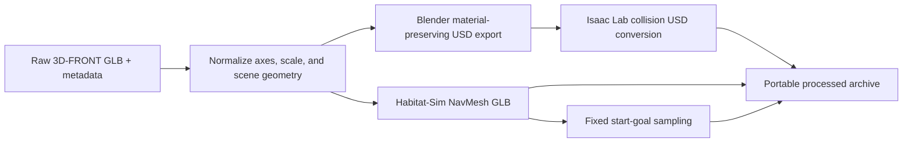

# 🧭 NavOL

[](https://arxiv.org/abs/2605.11762)
[](https://huggingface.co/datasets/WAboutme/NavOL)
[](https://openreview.net/forum?id=Uuh2Sk0mh0)
[](LICENSE)
[](source/navol/setup.py)

Official implementation of **NavOL: Navigation Policy with Online Imitation
Learning**, published at ICML 2026.

NavOL trains an embodied point-goal navigation policy through online imitation
learning in Isaac Lab. A privileged NavMesh expert supplies trajectory-level
supervision during simulation training; deployment uses only RGB-D observations
and the goal, without a map or expert planner.

**[arXiv](https://arxiv.org/abs/2605.11762) ·
[OpenReview](https://openreview.net/forum?id=Uuh2Sk0mh0) ·
[Models and data](https://huggingface.co/datasets/WAboutme/NavOL) ·
[中文说明](docs/README_zh-CN.md)**

## ✨ Highlights

- **Online imitation learning:** alternate simulator rollouts and updates on
  states visited by the current policy.
- **Safety-aware diffusion policy:** sample multiple waypoint trajectories and
  use a shared-backbone critic to rank candidates before execution.
- **Massively parallel training:** the canonical recipe uses 256 environments
  across eight GPUs and 50 processed 3D-FRONT scenes.
- **Portable release:** public launchers contain no personal cluster paths;
  large models, robot assets, and datasets are versioned separately on
  Hugging Face.
- **Reproducibility tools:** dependency-light command generation, archive
  validation, smoke tests, and CI can run without starting Isaac Sim.

## 🧭 Method at a glance



The expert-planning branch is used only for simulator training. The released
policy does not require a NavMesh at deployment time.

> **Runtime status.** The lightweight tests and command generation can run
> without Isaac Sim. Training and benchmark evaluation require a Linux
> workstation with a CUDA GPU, Isaac Sim 4.5, Isaac Lab 2.1, and Habitat-Sim.
> Those simulator workflows are not exercised by GitHub Actions.

[中文使用说明](docs/README_zh-CN.md)

## 🚀 Quick start

### 1. Prepare the simulator environment

Install Isaac Sim 4.5 and Isaac Lab 2.1 by following the
[Isaac Lab installation guide](https://isaac-sim.github.io/IsaacLab/main/source/setup/installation/index.html).
Activate the resulting Python environment, then clone NavOL and install its
three local packages:

```bash
git clone https://github.com/WAboutMe/NavOL.git
cd NavOL

python -m pip install -e source/rsl_rl
python -m pip install -e source/torchinterp1d
python -m pip install -e source/navol
```

NavOL also needs Habitat-Sim for NavMesh planning. Install a Habitat-Sim build
compatible with your CUDA/Python environment before starting Isaac Sim. The
NavOL package declares ordinary Python dependencies, while Isaac Sim, Isaac
Lab, PyTorch, and Habitat-Sim must be installed using their upstream
instructions.

Verify the dependency-light package import:

```bash
python -c "import navol; print(navol.__version__)"
```

Importing `navol.tasks` initializes Isaac Lab task registration and must be
done only inside the configured Isaac environment.

### 2. Choose an asset directory

Models and datasets are not stored in Git. The default asset directory is
`./assets`; on a shared machine, point NavOL at another directory:

```bash
export NAVOL_ASSET_ROOT=/absolute/path/to/navol-assets
mkdir -p "$NAVOL_ASSET_ROOT"
```

Path precedence is: an explicit CLI argument, then `NAVOL_ASSET_ROOT`, then
the repository-local `assets/` directory.

### 3. Download released artifacts

Install the Hugging Face CLI. Authenticate while the dataset repository is
private or gated; authentication is not required after it becomes public:

```bash
python -m pip install -U huggingface_hub
hf auth login
```

If `hf` is not found after a `--user` installation, open a new terminal or add
the Python user scripts directory to `PATH`. On Linux it is usually
`$(python -m site --user-base)/bin`; on Windows it is usually the `Scripts`
directory below the path printed by `python -m site --user-base`.

| Released artifact | Hugging Face path | Local path below `NAVOL_ASSET_ROOT` | Required for |
|---|---|---|---|
| NavDP initialization | `models/navdp-cross-modal.ckpt` | `models/navdp-cross-modal.ckpt` | Training |
| Canonical NavOL policy | `models/checkpoints/navol-mpc-iter1000.pt` | `models/checkpoints/navol-mpc-iter1000.pt` | Evaluation |
| Additional NavOL policies | `models/checkpoints/*.pt` | `models/checkpoints/*.pt` | Ablations/inspection |
| Dingo robot | `robots/dingo.usd` | `robots/dingo.usd` | Training and evaluation |
| Processed 50-scene set | `datasets/train/3d_front_scene_50/` | `datasets/train/3d_front_scene_50/` | Training |
| Processed benchmark ZIPs | `data/benchmarks/processed/` | Extract to `datasets/benchmarks/` | Evaluation |
| Raw benchmark ZIPs | `data/benchmarks/raw/` | User-selected workspace | Optional pipeline research |

Download the NavDP initialization checkpoint, four released NavOL policy
checkpoints, and Dingo robot asset directly into the asset layout:

```bash
hf download WAboutme/NavOL \
  --repo-type dataset \
  --include "models/navdp-cross-modal.ckpt" \
  --include "models/checkpoints/*" \
  --include "robots/dingo.usd" \
  --local-dir "$NAVOL_ASSET_ROOT"
```

Download the processed 50-scene training asset directly into the same layout:

```bash
hf download WAboutme/NavOL \
  --repo-type dataset \
  --include "datasets/train/3d_front_scene_50/**" \
  --local-dir "$NAVOL_ASSET_ROOT"
```

Download the processed benchmark archives to a temporary download directory:

```bash
hf download WAboutme/NavOL \
  --repo-type dataset \
  --include "data/benchmarks/processed/*" \
  --local-dir downloads/navol

mkdir -p "$NAVOL_ASSET_ROOT/datasets/benchmarks"
python -m zipfile -e \
  downloads/navol/data/benchmarks/processed/navol_benchmark_in_domain.zip \
  "$NAVOL_ASSET_ROOT/datasets/benchmarks"
python -m zipfile -e \
  downloads/navol/data/benchmarks/processed/navol_benchmark_out_domain.zip \
  "$NAVOL_ASSET_ROOT/datasets/benchmarks"
```

After extraction, the required layout is:

```text
navol-assets/
├── models/
│   ├── navdp-cross-modal.ckpt
│   └── checkpoints/
│       ├── navol-mpc-iter1000.pt
│       ├── navol-mpc-iter500.pt
│       ├── navol-nompc-iter200.pt
│       └── navol-rollout128-iter100.pt
├── robots/
│   └── dingo.usd
└── datasets/
    ├── train/
    │   └── 3d_front_scene_50/
    │       ├── index.json
    │       ├── selected.json
    │       ├── scene.glb
    │       ├── usd/
    │       │   ├── config.yaml
    │       │   ├── scene.usd
    │       │   └── textures/
    │       └── navmesh_scenes/scene_*.glb
    └── benchmarks/
        ├── in_domain/scene_000 ... scene_007/
        └── out_domain/scene_000 ... scene_007/
```

Every benchmark scene directory contains `scene.glb`, `scene.usd`,
`navmesh_scene.glb`, `sample_100.npy`, and `textures/`. The training workflow
additionally requires the 50-scene training asset shown above and
`models/navdp-cross-modal.ckpt`. See [the data guide](scripts/data/README.md)
for raw archives, validation, and USD reconstruction.

The Hugging Face repository provides the NavDP initialization checkpoint, the
four `.pt` NavOL policy checkpoints, `robots/dingo.usd`, the processed
50-scene training asset, and the processed/raw benchmark archives. The commands
above place these files in the paths resolved by the public launchers.

The released training asset records the canonical 50-scene selection in
`selected.json`. It intentionally does not include `sample_100.npy`: canonical
random training uses `sample_from_npy=False`. A fixed reset array is required
only when that option is explicitly enabled.

### 4. Inspect commands before using the simulator

The dry runs print complete commands without starting Isaac Sim:

```bash
python scripts/train/train_navol.py --dry-run
python scripts/eval/evaluate_benchmark.py --dry-run
```

Check the repository's public release surface without reading models or data:

```bash
python scripts/check_release.py
```

## 🏋️ Training

Start the canonical eight-GPU job from the activated Isaac environment:

```bash
python scripts/train/train_navol.py
```

Use fewer local processes only when adapting the run to available hardware:

```bash
python scripts/train/train_navol.py --num-processes 1 --run-name navol_local
```

The canonical launcher explicitly supplies 8 processes, 32 environments per
process, 128 rollout steps, 10 learning epochs, 16 mini-batches, a global
mini-batch size of 2048, and 1000 iterations. Camera height is randomized in
`(0.25, 1.25)` metres and pitch in `(-30, 0)` degrees. MPC and camera
randomization are enabled. Training logs and checkpoints are written below
`logs/rsl_rl/dingo_pointgoal_distillation/`.

See [scripts/train/README.md](scripts/train/README.md) for the complete asset
contract and configuration details.

## 📊 Benchmark evaluation

Evaluate both public benchmark splits with the default
`models/checkpoints/navol-mpc-iter1000.pt` checkpoint:

```bash
python scripts/eval/evaluate_benchmark.py
```

Evaluate one split or use an alternate output directory:

```bash
python scripts/eval/evaluate_benchmark.py \
  --split in_domain \
  --output-root results/in_domain
```

The launcher covers eight scenes per split with one environment and 100
episodes per scene. Results are written under the selected output root. The
low-level metric implementation is in `scripts/rsl_rl/eval_navdp.py`; the
public launcher does not reinterpret episode termination as success.

See [scripts/eval/README.md](scripts/eval/README.md) for checkpoint selection,
scene layout, output files, and common failures.

## 🧩 Data preparation

Most users should use the processed benchmark archives. They contain portable
scene-relative USD texture references and fixed `(100, 7)` start-goal arrays.



The public pipeline deliberately separates reusable processing primitives from
dataset-specific source metadata. Processed assets are the supported path for
training and evaluation; raw archives are provided for inspection and pipeline
research rather than as drop-in runtime data.

If a supplied USD is incompatible with your Isaac Sim/OpenUSD build, recreate
only the extracted USD while keeping the downloaded ZIP unchanged:

```bash
python scripts/data/prepare_benchmark.py convert-usd \
  "$NAVOL_ASSET_ROOT/datasets/benchmarks/in_domain/scene_000" \
  --dry-run

# Remove --dry-run after inspecting the two generated commands.
```

The raw in-domain and out-of-domain ZIP files are available for research and
inspection. Rebuilding every processing stage from raw scenes requires
Blender, Isaac Lab, Habitat-Sim, and dataset-specific source metadata; it is
not required for reproducing the released benchmark evaluation. See
[scripts/data/README.md](scripts/data/README.md).

## 🧪 Tests

These checks do not initialize Isaac Sim:

```bash
python -m unittest discover -s tests/unit -p 'test_*.py' -v
python -m unittest discover -s tests/smoke -p 'test_*.py' -v
python -m unittest discover -s tests/data -p 'test_*.py' -v
python -m compileall -q source/navol/navol source/rsl_rl/rsl_rl scripts tests
```

Data tests skip automatically when benchmark assets are not installed.
End-to-end simulator validation must be run separately on the target
Isaac Lab/CUDA machine.

## ✅ Reproducibility scope

| Workflow | Dependency-light CI | Isaac/CUDA machine |
|---|:---:|:---:|
| Package metadata and imports | ✓ | ✓ |
| Asset-path and command generation | ✓ | ✓ |
| ZIP validation and portable-path checks | ✓ | ✓ |
| Canonical training rollout | — | required |
| Full benchmark simulation | — | required |
| Habitat-Sim expert planning | — | required |

The public launchers encode the canonical paper-scale configuration, but GPU
training time and simulator results must be reproduced in a compatible Linux
Isaac Lab environment.

## 🗂️ Repository structure

```text
NavOL/
├── assets/                 # local models, datasets, and robot assets
├── scripts/
│   ├── data/               # portable archive build/validation/repair
│   ├── train/              # canonical training launcher
│   ├── eval/               # canonical benchmark launcher
│   ├── rsl_rl/             # low-level Isaac Lab/RSL-RL runtime
│   ├── preprocess/         # reusable scene-processing primitives
│   └── experiments/        # non-canonical research/ablation recipes
├── source/navol/           # Isaac Lab extension and `navol` package
├── source/rsl_rl/          # NavOL-compatible RSL-RL fork
├── source/torchinterp1d/   # vendored interpolation dependency
└── tests/                  # unit, smoke, and optional data tests
```

## 📝 Citation

If NavOL is useful in your research, please cite:

```bibtex
@inproceedings{wei2026navol,
  title     = {Nav{OL}: Navigation Policy with Online Imitation Learning},
  author    = {Xiaofei Wei and Chun Gu and Li Zhang},
  booktitle = {Forty-third International Conference on Machine Learning},
  year      = {2026},
  url       = {https://openreview.net/forum?id=Uuh2Sk0mh0}
}
```

## 🙏 Acknowledgements

NavOL builds on Isaac Lab, Isaac Sim, Habitat-Sim, RSL-RL, NavDP,
Depth Anything V2, and 3D-FRONT. We thank their authors and maintainers.
Vendored code and redistributed assets retain their original terms; see the
third-party notice for details.

## 📄 License

NavOL code is released under the BSD 3-Clause License. Vendored components
retain their original licenses; see [THIRD_PARTY_NOTICES.md](THIRD_PARTY_NOTICES.md).
Model, robot, and dataset files may carry separate terms in the Hugging Face
dataset card or their upstream sources. The code license does not override
those asset licenses.
