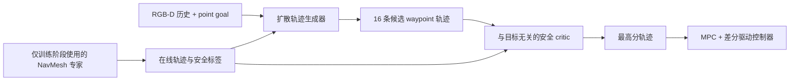
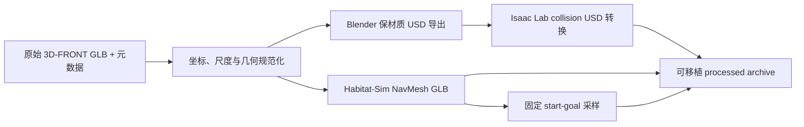

# 🧭 NavOL 中文使用说明

[](https://arxiv.org/abs/2605.11762)
[](https://huggingface.co/datasets/WAboutme/NavOL)
[](https://openreview.net/forum?id=Uuh2Sk0mh0)
[](../LICENSE)

本仓库是 ICML 2026 论文 **NavOL: Navigation Policy with Online Imitation
Learning** 的官方实现。

NavOL 是一个在 Isaac Lab 中通过在线模仿学习训练的具身点目标导航策略。训练阶段由具有地图权限的 NavMesh 专家提供轨迹级监督；部署阶段只使用 RGB-D 观测和目标，不需要地图或专家规划器。本仓库把数据准备、策略训练和 benchmark 评测拆分为三个清晰的公开工作流。

**[arXiv](https://arxiv.org/abs/2605.11762) ·
[OpenReview](https://openreview.net/forum?id=Uuh2Sk0mh0) ·
[模型与数据](https://huggingface.co/datasets/WAboutme/NavOL) ·
[English README](../README.md)**

## 核心特点

- **在线模仿学习：**在当前策略真实访问的状态上交替执行模拟器 rollout 与模型更新。
- **带安全排序的扩散策略：**生成多条候选 waypoint 轨迹，由共享骨干的 critic 排序后执行。
- **大规模并行训练：**canonical 配置使用 8 张 GPU、256 个并行环境和 50 个处理好的 3D-FRONT 场景。
- **可移植发布：**公开入口不含个人集群路径；模型、机器人和数据资产统一存放在 Hugging Face。
- **可复现工具：**命令 dry-run、ZIP 校验、smoke tests 和 CI 不需要启动 Isaac Sim。

## 方法概览



> **运行环境说明：**不依赖 Isaac Sim 的单元测试、发布检查和 `--dry-run` 可以在普通 Python 环境运行。真正的训练和 benchmark 评测需要 Linux、CUDA GPU、Isaac Sim 4.5、Isaac Lab 2.1 和 Habitat-Sim。本仓库的 GitHub Actions 不运行模拟器端到端测试。

## 1. 安装

先按照 [Isaac Lab 官方文档](https://isaac-sim.github.io/IsaacLab/main/source/setup/installation/index.html) 安装 Isaac Sim 4.5 与 Isaac Lab 2.1，并进入相应 Python 环境。然后在仓库根目录执行：

```bash
git clone https://github.com/WAboutMe/NavOL.git
cd NavOL

python -m pip install -e source/rsl_rl
python -m pip install -e source/torchinterp1d
python -m pip install -e source/navol
```

还需要在同一环境中安装与 Python/CUDA 匹配的 Habitat-Sim。Isaac Sim、Isaac Lab、PyTorch 和 Habitat-Sim 应按各自官方方法安装，不由普通 pip 依赖自动替代。

先验证轻量导入：

```bash
python -c "import navol; print(navol.__version__)"
```

`import navol.tasks` 会注册 Isaac Lab 任务，只应在完整的 Isaac 环境中运行。

## 2. 规定模型与数据根目录

默认根目录是仓库内的 `assets/`。如果模型和数据放在共享磁盘，设置：

```bash
export NAVOL_ASSET_ROOT=/absolute/path/to/navol-assets
mkdir -p "$NAVOL_ASSET_ROOT"
```

路径优先级为：命令行显式路径 > `NAVOL_ASSET_ROOT` > 仓库内 `assets/`。

| 发布资产 | Hugging Face 路径 | `NAVOL_ASSET_ROOT` 下的本地路径 | 用途 |
|---|---|---|---|
| NavDP 初始化模型 | `models/navdp-cross-modal.ckpt` | `models/navdp-cross-modal.ckpt` | 训练 |
| Canonical NavOL 策略 | `models/checkpoints/navol-mpc-iter1000.pt` | `models/checkpoints/navol-mpc-iter1000.pt` | 评测 |
| 其他 NavOL 策略 | `models/checkpoints/*.pt` | `models/checkpoints/*.pt` | 消融/检查 |
| Dingo 机器人 | `robots/dingo.usd` | `robots/dingo.usd` | 训练与评测 |
| 50-scene 处理数据 | `datasets/train/3d_front_scene_50/` | `datasets/train/3d_front_scene_50/` | 训练 |
| 处理后的 benchmark ZIP | `data/benchmarks/processed/` | 解压到 `datasets/benchmarks/` | 评测 |
| 原始 benchmark ZIP | `data/benchmarks/raw/` | 用户指定工作目录 | 可选管线研究 |

完整布局如下：

```text
navol-assets/
├── models/
│   ├── navdp-cross-modal.ckpt
│   └── checkpoints/
│       ├── navol-mpc-iter1000.pt
│       ├── navol-mpc-iter500.pt
│       ├── navol-nompc-iter200.pt
│       └── navol-rollout128-iter100.pt
├── robots/dingo.usd
└── datasets/
    ├── train/3d_front_scene_50/
    │   ├── index.json
    │   ├── selected.json
    │   ├── scene.glb
    │   ├── usd/
    │   │   ├── config.yaml
    │   │   ├── scene.usd
    │   │   └── textures/
    │   └── navmesh_scenes/scene_*.glb
    └── benchmarks/
        ├── in_domain/scene_000 ... scene_007/
        └── out_domain/scene_000 ... scene_007/
```

其中：

- `navdp-cross-modal.ckpt` 是训练初始化所需的 NavDP 跨模态基础模型，不是最终 NavOL 策略；
- `navol-mpc-iter1000.pt` 是公开评测入口默认加载的 NavOL 策略；
- `dingo.usd` 是训练和评测都需要的机器人资产；
- 50-scene 数据只用于训练；
- in-domain 与 out-domain 两个 split 用于公开 benchmark。

## 3. 下载已发布资产

```bash
python -m pip install -U huggingface_hub
hf auth login  # 数据集公开后可不登录；受限状态下需要登录
```

如果使用 `pip install --user` 后系统仍提示找不到 `hf`，请重新打开终端，或把 Python 用户脚本目录加入 `PATH`。Linux 通常是 `$(python -m site --user-base)/bin`；Windows 通常是 `python -m site --user-base` 输出目录下的 `Scripts`。

将 NavDP 初始化 checkpoint、四个 NavOL 策略 checkpoint 和 Dingo 机器人资产直接下载到规定的资产根：

```bash
hf download WAboutme/NavOL \
  --repo-type dataset \
  --include "models/navdp-cross-modal.ckpt" \
  --include "models/checkpoints/*" \
  --include "robots/dingo.usd" \
  --local-dir "$NAVOL_ASSET_ROOT"
```

将处理好的 50-scene 训练资产直接下载到同一资产根：

```bash
hf download WAboutme/NavOL \
  --repo-type dataset \
  --include "datasets/train/3d_front_scene_50/**" \
  --local-dir "$NAVOL_ASSET_ROOT"
```

下载并解压处理好的 benchmark：

```bash
hf download WAboutme/NavOL \
  --repo-type dataset \
  --include "data/benchmarks/processed/*" \
  --local-dir downloads/navol

mkdir -p "$NAVOL_ASSET_ROOT/datasets/benchmarks"
python -m zipfile -e \
  downloads/navol/data/benchmarks/processed/navol_benchmark_in_domain.zip \
  "$NAVOL_ASSET_ROOT/datasets/benchmarks"
python -m zipfile -e \
  downloads/navol/data/benchmarks/processed/navol_benchmark_out_domain.zip \
  "$NAVOL_ASSET_ROOT/datasets/benchmarks"
```

每个 benchmark 场景应直接包含：

```text
scene.glb
scene.usd
navmesh_scene.glb
sample_100.npy
textures/
```

不要把 out-domain 解压到 in-domain 目录内，也不要在 split 根目录混入其他文件夹。底层评测代码按排序后的 `scene_*` 目录选择场景。

HF 当前提供 NavDP 初始化 checkpoint、四个 `.pt` NavOL 策略 checkpoint、`robots/dingo.usd`、处理后的 50-scene 训练资产，以及 processed/raw benchmark 压缩包。上述命令会把模型和机器人资产直接放到公开入口读取的规定路径。

发布的训练资产使用 `selected.json` 记录 canonical 50-scene 选择。训练包不包含 `sample_100.npy`：canonical 随机训练设置为 `sample_from_npy=False`，只有显式启用固定 reset 样本时才需要该文件。

## 4. 数据检查与 USD 兼容问题



公开管线将可复用的处理脚本与数据源特定元数据分开。训练和评测应直接使用 processed 资产；raw ZIP 用于检查或扩展数据管线，不能直接作为运行时数据集。

可以不解压 ZIP，直接流式验证处理包：

```bash
python scripts/data/prepare_benchmark.py validate \
  downloads/navol/data/benchmarks/processed/navol_benchmark_in_domain.zip \
  --split in_domain
```

如果随包提供的 `scene.usd` 无法被本机 Isaac Sim/OpenUSD 打开，不要修改原 ZIP。先查看单场景转换命令：

```bash
python scripts/data/prepare_benchmark.py convert-usd \
  "$NAVOL_ASSET_ROOT/datasets/benchmarks/in_domain/scene_000" \
  --dry-run
```

确认后去掉 `--dry-run`。转换分为 Blender 材质导出和 Isaac Lab collision 转换两步，只替换已解压目录中的 `scene.usd`。

原始 in-domain/out-domain ZIP 是研究用源材料，不能直接作为评测目录。完整数据说明见 [scripts/data/README.md](../scripts/data/README.md)。

## 5. 训练

先打印完整命令，不启动 Isaac Sim：

```bash
python scripts/train/train_navol.py --dry-run
```

确认资产路径后启动 canonical 训练：

```bash
python scripts/train/train_navol.py
```

canonical 配置为 8 个进程、每进程 32 个环境、128 rollout steps、10 learning epochs、16 mini-batches、global batch 2048、1000 iterations。相机高度随机范围是 `(0.25, 1.25)` 米，pitch 范围是 `(-30, 0)` 度；MPC 和相机随机化均开启。

单 GPU 集成检查可使用：

```bash
python scripts/train/train_navol.py \
  --num-processes 1 \
  --run-name navol_integration
```

它不等同于 canonical 多 GPU 复现实验。训练输出位于 `logs/rsl_rl/dingo_pointgoal_distillation/`。详细说明见 [scripts/train/README.md](../scripts/train/README.md)。

## 6. Benchmark 评测

先打印 16 个场景命令：

```bash
python scripts/eval/evaluate_benchmark.py --dry-run
```

评测两个 split：

```bash
python scripts/eval/evaluate_benchmark.py
```

只评测 in-domain：

```bash
python scripts/eval/evaluate_benchmark.py --split in_domain
```

指定其他 checkpoint：

```bash
python scripts/eval/evaluate_benchmark.py \
  --checkpoint /path/to/model_1000_navdp.pt \
  --output-root results/custom_checkpoint
```

每个场景使用 1 个环境和 100 个 episode。episode 结束（`done`）只触发指标结算，不等同于 success；当前底层代码会再根据平面目标距离独立计算 success。公开 wrapper 不改写底层评测语义。详细说明见 [scripts/eval/README.md](../scripts/eval/README.md)。

## 7. 本地可运行的检查

以下命令不启动 Isaac Sim：

```bash
python -m unittest discover -s tests/unit -p 'test_*.py' -v
python -m unittest discover -s tests/smoke -p 'test_*.py' -v
python -m unittest discover -s tests/data -p 'test_*.py' -v
python -m compileall -q source/navol/navol source/rsl_rl/rsl_rl scripts tests
python scripts/check_release.py
```

没有安装 benchmark 时，数据测试会自动 skip。训练与评测的最终确认仍需在目标集群的 Isaac Lab/CUDA 环境完成。

## 8. 可复现范围

| 工作流 | 轻量 CI | Isaac/CUDA 环境 |
|---|:---:|:---:|
| 包元数据与轻量导入 | ✓ | ✓ |
| 资产路径和命令生成 | ✓ | ✓ |
| ZIP 布局与可移植路径校验 | ✓ | ✓ |
| Canonical 训练 rollout | — | 必需 |
| 完整 benchmark 仿真 | — | 必需 |
| Habitat-Sim 专家规划 | — | 必需 |

## 9. 引用

如果 NavOL 对您的研究有帮助，请引用：

```bibtex
@inproceedings{wei2026navol,
  title     = {Nav{OL}: Navigation Policy with Online Imitation Learning},
  author    = {Xiaofei Wei and Chun Gu and Li Zhang},
  booktitle = {Forty-third International Conference on Machine Learning},
  year      = {2026},
  url       = {https://openreview.net/forum?id=Uuh2Sk0mh0}
}
```

## 10. 致谢与许可证

NavOL 基于 Isaac Lab、Isaac Sim、Habitat-Sim、RSL-RL、NavDP、Depth Anything V2 和 3D-FRONT 构建，感谢这些项目的作者和维护者。

NavOL 代码使用 BSD 3-Clause License。仓库内 RSL-RL fork 和 torchinterp1d 保留其原始许可证，详见 [THIRD_PARTY_NOTICES.md](../THIRD_PARTY_NOTICES.md)。模型、机器人和数据可能有各自的许可条款；代码许可证不会覆盖这些资产条款。
